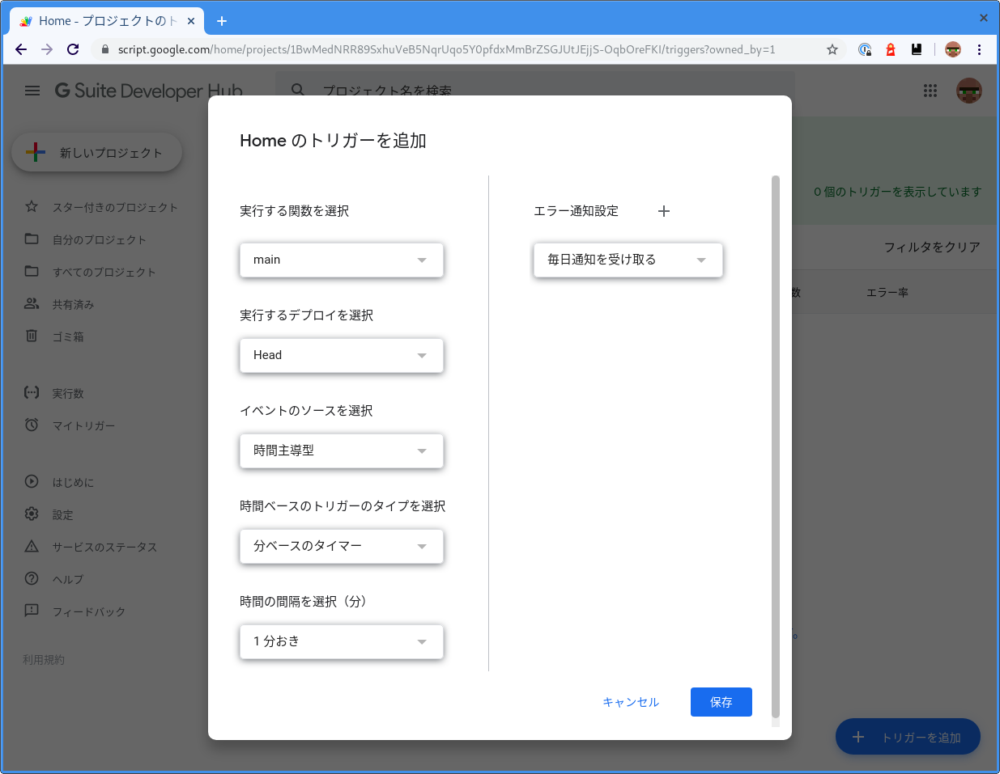

# TODO

[Google Apps Script](https://developers.google.com/apps-script) を利用し [Nature Remo](https://nature.global/jp/nature-remo) の API から温度、湿度を記録しています。

## 必要なもの

- Node.js

## 動かし方

### 1. スクリプトを Google Apps Script へデプロイ

```
$ yarn install
$ yarn run rollup --environment SECRET:SECRET --config rollup.config.js --no-treeshake
$ yarn run clasp push
$ yarn run clasp open
```

### 2. Web UI からトリガーを設定

API 経由ではトリガーを設定出来ないため [WEB UI](https://script.google.com/home/triggers) から設定する。



### 3. 好きな方法で可視化する

これは [Data Portal](https://datastudio.google.com/overview) を利用した例。


